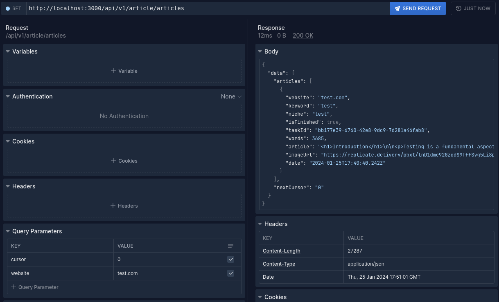
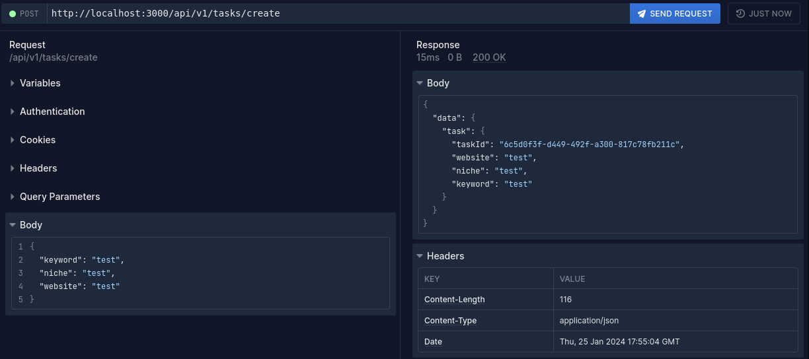

# AI Article Writer

AI article writer which can write articles from 1,500 to 7,000+ words!

Provide Keyword (right now it's article title) and niche!

Let the AI do the work for you!

# Usage

Prerequisites:

1. Docker & Docker compose installed
2. OpenAI API key
3. Replicate key (optional)

Just run:

```
docker compose up
```

The API and writer worker will start.

You could visit: `http://localhost:3000/swagger` to see the endpoints and have a playground for writing & browsing articles.

## Browsing articles

`http://localhost:3000/api/v1/article/articles?cursor=0&website=test.com`

Paginate via cursor, response will hold the next page cursor.



## Writing articles

Make a POST request `http://localhost:3000/api/v1/tasks/create/`

with body

```json
{
  "keyword": "Article title",
  "niche": "article niche",
  "website": "test.com"
}
```

`keyword` - right now use it as a title, perhaps future versions will also generate a title
`niche` - your article/website niche for larger context
`website` - your website identifier. Used for browsing articles.



## Development

This app uses [Bun](https://bun.sh) runtime, so you will need to have it installed.

To run the API:

`bun run dev`

To run the worker:

`bun src/worker/articleWriterWorker.ts`

## Contributing

All contributions are welcome!

## Roadmap

✅ Base API and worker released

⏳ Website released for users who cannot use API

⏳ Internal/external linking for articles
